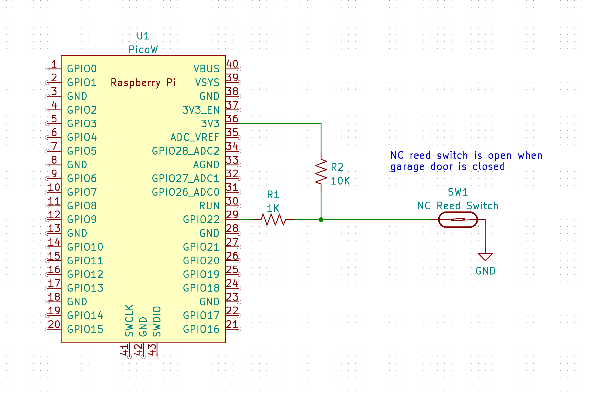

# Pico W Garage Door Sensor

Get notified when your garage door's been left open. This sensor uses the Raspberry Pi Pico W and MicroPython.

## Hardware

The Raspberry Pi Pico W is powered by a standard 5V USB Micro B power supply.

GPIO 22 is pulled up to 3.3V with a 10K ohm resistor. This external pull-up resistor is stronger than the Pico's internal pull-up resistors that can be configured on the GPIO pins and helps reduce the effects of ESD on the long wires from the Pico to the reed switch. GPIO 22 also has an optional 1K ohm current-limiting resistor (even a lower value like 100 ohms is fine) to protect it from shorting to ground in case it is misconfigured as an output pin.

Why GPIO 22? It doesn't have any alternative function like SPI, I2C, or ADC. This leaves all the other GPIO pins free if you want to attach a screen or other peripherals to your Pico.

You could add a small capacitor to debounce the reed switch in hardware but this project debounces the GPIO pin in software.

### Schematic

### BOM

| Reference | Part description                                                                               | Example part #                                                                                                                                                                                |
|-----------|------------------------------------------------------------------------------------------------|-----------------------------------------------------------------------------------------------------------------------------------------------------------------------------------------------|
| R1        | 1K ohm current-limiting resistor (optional)                                                    | [CF14JT1K00](https://www.digikey.com/en/products/detail/stackpole-electronics-inc/CF14JT1K00/1741314)                                                                                         |
| R2        | 1K ohm pull-up resistor                                                                        | [CF14JT10K0](https://www.digikey.com/en/products/detail/stackpole-electronics-inc/CF14JT10K0/1741265)                                                                                         |
| SW1       | SPST NC reed switch                                                                            | [59140-4-S-02-F](https://www.digikey.com/en/products/detail/littelfuse-inc/59140-4-S-02-F/4780045) and [57140-000](https://www.digikey.com/en/products/detail/littelfuse-inc/57140-000/43978) |
| U1        | Raspberry Pi Pico W                                                                            | [04025C104KAT2A](https://www.digikey.com/en/products/detail/kyocera-avx/04025C104KAT2A/6564238)                                                                                               |
|           | USB Micro B power supply (5V@1A is plenty)                                                     |                                                                                                                                                                                               |
|           | Stranded copper wire, 22-24 AWG (long enough to reach your garage door from the Pico and back) |                                                                                                                                                                                               |
## Software

Install MicroPython on your Pico W using [a .uf2 file](https://micropython.org/download/rp2-pico-w/) from the MicroPython website.

